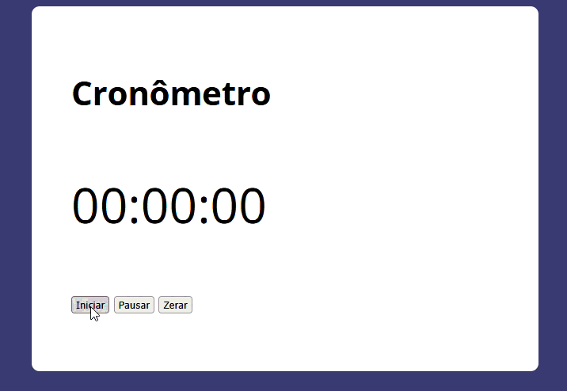

# Cronômetro

Aplicação de cronômetro desenvolvida com **HTML, CSS e JavaScript**, permitindo iniciar, pausar e zerar.

---

## Funcionalidades

* Iniciar contagem do tempo
* Pausar cronômetro
* Zerar contagem
* Atualização dinâmica na tela

---

## Tecnologias

* HTML5
* CSS3
* JavaScript 

---

## Estrutura do projeto

```
📁 projeto
 ┣ 📁 assets
 ┃ ┣ 📁 css
 ┃ ┣ 📁 gif
 ┃ ┗ 📁 js
 ┣ 📄 index.html
```

---

## 📸 Preview

Demonstração do funcionamento do cronômetro:



---

## 📌 Aprendizados

* Manipulação de DOM
* Controle de tempo com `setInterval`
* Eventos de clique
* Organização de código JavaScript

---

## 📄 Licença

Projeto desenvolvido para fins de estudo.
